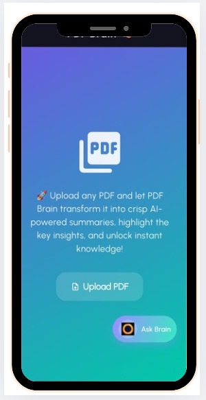

# 📚 PDF Brain

PDF Brain is a smart tool that helps you *read, understand, and summarize large PDF documents quickly and efficiently*.  
Instead of wasting hours scrolling through pages, PDF Brain extracts the key points and gives you concise summaries.  

---

## 🚀 Features
- 📄 Upload and process PDF documents  
- 🧠 Generate quick summaries in bullet points  
- 🔎 Search and highlight important sections  
- ⚡ Save time by focusing only on what matters  
- 🌐 Simple and user-friendly interface  

---

## 🛠 Tech Stack
- *Frontend*: [Flutter] 
- *Other*: Gemini API

---

## 📖 How It Works
1. Upload your PDF  
2. The system processes the text  
3. Get a *summary in easy bullet points*  
4. Optionally search, highlight, or extract sections  

---

## 📸 Screenshots



---

## 📦 Installation

Clone the repository:
```bash
git clone https://github.com/rly09/E404.git
cd pdf-brain
